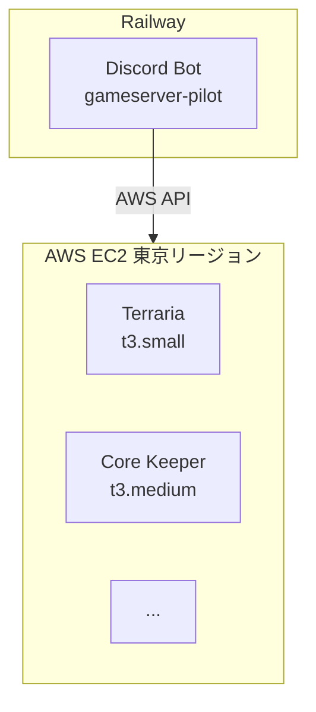

# アーキテクチャ

## 全体構成

## コンポーネント

### Discord Bot（Railway）

- Discordスラッシュコマンドを受け付け
- boto3でEC2インスタンスを操作
- プレイヤー不在時の自動停止ロジックを実行

### ゲームサーバー（AWS EC2）

- 各ゲームサーバーは個別のEC2インスタンスで稼働
- 停止時はストレージのみ課金

## 拡張ポイント（Strategy Pattern）

このプロジェクトは2つの抽象クラスによる拡張ポイントを持つ。

### CloudProvider (`cloud/base.py`)

クラウドプロバイダーの抽象化。

- メソッド: `start_server()`, `stop_server()`, `get_server_status()`
- 実装: EC2Provider（本番）、MockProvider（開発）

### PlayerMonitor (`monitors/base.py`)

プレイヤー数取得の抽象化。

- メソッド: `get_player_count()`
- 実装: TShockMonitor（REST API）、LogFileMonitor（ログ監視）

## 環境による切り替え

`ENV`環境変数でCloudProviderの実装を切り替える。

| ENV | Provider | 用途 |
|-----|----------|------|
| `development` | MockProvider | EC2を操作しない開発モード |
| `production` | EC2Provider | 実際のEC2を操作 |
