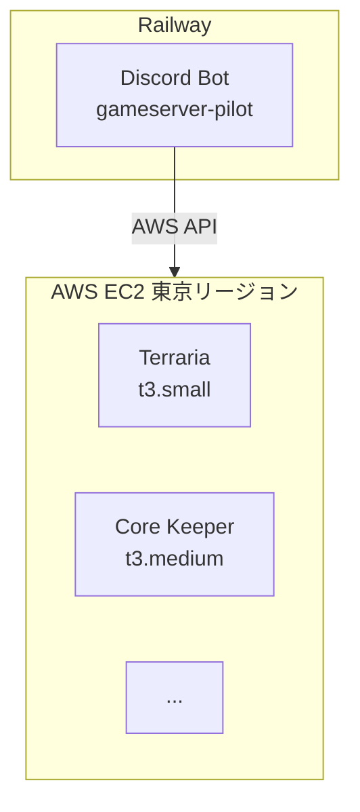

# アーキテクチャ

## 全体構成

```mermaid
flowchart TB
    subgraph Railway
        Bot[Discord Bot<br/>gameserver-pilot]
    end

    Bot -->|AWS API| EC2

    subgraph EC2[AWS EC2 東京リージョン]
        Terraria[Terraria<br/>t3.small]
        CoreKeeper[Core Keeper<br/>t3.medium]
        GameN[...]
    end
```

## コンポーネント

### Discord Bot（Railway）

- Discordスラッシュコマンドを受け付け
- boto3でEC2インスタンスを操作
- プレイヤー不在時の自動停止ロジックを実行

### ゲームサーバー（AWS EC2）

- 各ゲームサーバーは個別のEC2インスタンスで稼働
- 停止時はストレージのみ課金
