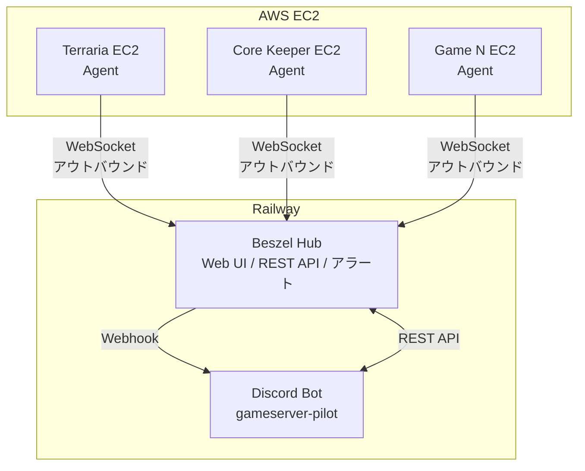

# Beszel リソース監視設計

## 概要

gameserver-pilotにおけるEC2ゲームサーバーのリソース監視機能の設計です。
Beszelを採用し、Discord連携によるアラート通知と定期レポートを実現します。

## 要件

### 機能要件

- EC2インスタンスのリソース監視（CPU、メモリ、ディスク、ネットワーク）
- 異常検知時のDiscordアラート通知
- 定期的なステータスレポートのDiscord送信

### 非機能要件

- ゲームサーバー停止時も監視基盤は稼働継続
- VPN（Tailscale等）を使用しないシンプルな構成
- ゲームサーバーへのリソース影響を最小限に

## アーキテクチャ

### 全体構成



### コンポーネント

| コンポーネント | 配置先 | 役割 |
|---------------|--------|------|
| Beszel Hub | Railway | メトリクス収集・保存・可視化・アラート |
| Beszel Agent | 各EC2 | ホストのメトリクス送信 |
| Discord Bot | Railway | サーバー操作・レポート送信・アラート受信 |

### 配置先の選定理由

Beszel Hub を Railway に配置する理由

1. 可用性: ゲームサーバーEC2が停止しても監視継続可能
2. 管理の一元化: Discord Botと同一プラットフォームで運用
3. デプロイ容易性: ワンクリックデプロイテンプレート利用可
4. コスト: 約$5/月（Hobbyプラン）

ゲームサーバーEC2同居を避ける理由

- `/stop`コマンドでEC2停止時にHubも停止してしまう
- 監視の単一障害点になる

## 通信方式

### WebSocketモード

Beszelは2つの接続方式をサポートしますが、WebSocketモードを採用します。

| 方式 | 接続方向 | ポート | VPN要否 |
|------|----------|--------|---------|
| SSHモード | Hub → Agent | 45876 (インバウンド) | 推奨 |
| WebSocketモード | Agent → Hub | 443 (アウトバウンド) | 不要 |

WebSocketモードの利点

- Agent側でインバウンドポートを開ける必要がない
- トークン + SSH鍵 + マシンフィンガープリントによる相互認証
- Security Groupの設定がシンプル

### AWS Security Group設定

```text
ゲームサーバーEC2 Security Group

インバウンド
  - ゲームポート (例: Terraria 7777/TCP, Core Keeper 27015/UDP)

アウトバウンド
  - TCP 443 0.0.0.0/0 (HTTPS: Beszel Hub接続、パッケージ更新)
  - ゲーム固有のアウトバウンド
```

## Discord連携

### アラート通知（Beszel標準機能）

Beszelの組み込みアラート機能とShoutrrr連携を使用します。

対応アラート種別

| アラート | 推奨閾値 | 用途 |
|----------|----------|------|
| CPU | > 80% | 高負荷検知 |
| Memory | > 90% | メモリ逼迫 |
| Disk | > 85% | ストレージ不足 |
| Status | offline | サーバーダウン検知 |

Webhook設定

```text
Discord Webhook URL
https://discord.com/api/webhooks/webhook_id/token

Shoutrrr形式（Beszelに設定）
discord://token@webhook_id
```

### 定期レポート（Bot実装）

Beszelには定期レポート機能がないため、Discord Bot側で実装します。

実装方針

1. Discord BotからBeszel REST API（PocketBase）を定期的に呼び出し
2. 取得したメトリクスをEmbed形式でDiscordに送信
3. `discord.ext.tasks`のループ機能を使用

レポート内容

- 各サーバーの現在のステータス（online/offline）
- CPU/メモリ/ディスク使用率
- 直近24時間のピーク値（オプション）

## 実装詳細

### Beszel Hub（Railway）

デプロイ方法

Railway公式テンプレートを使用
<https://railway.com/deploy/nJKarX>

環境変数

```env
# 必須ではないがセキュリティ向上のため推奨
DISABLE_PASSWORD_AUTH=false  # OAuth設定後にtrueへ
```

永続化

Railwayのボリュームマウントで`/beszel_data`を永続化

### Beszel Agent（各EC2）

インストール方法（バイナリ推奨）

```bash
curl -sL https://get.beszel.dev/agent | bash -s -- \
  --hub-url "https://beszel-hub.railway.app" \
  --token "registration-token" \
  --key "ssh-public-key" \
  --auto-update
```

リソース消費

- メモリ: 約6MB
- CPU: 無視できるレベル

Docker Compose代替案

```yaml
services:
  beszel-agent:
    image: henrygd/beszel-agent:latest
    container_name: beszel-agent
    restart: unless-stopped
    network_mode: host
    volumes:
      - /var/run/docker.sock:/var/run/docker.sock:ro
    environment:
      HUB_URL: "https://beszel-hub.railway.app"
      TOKEN: "${BESZEL_TOKEN}"
      KEY: "${BESZEL_KEY}"
```

### Discord Bot拡張

新規追加するモジュール構成

```text
gameserver_pilot/
├── monitoring/
│   ├── __init__.py
│   ├── beszel_client.py   # Beszel API クライアント
│   └── reporter.py        # 定期レポート生成
```

Beszel APIクライアント実装例

```python
# gameserver_pilot/monitoring/beszel_client.py
import aiohttp
from dataclasses import dataclass

@dataclass
class ServerMetrics:
    name: str
    status: str
    cpu: float
    memory: float
    disk: float

class BeszelClient:
    def __init__(self, hub_url: str, email: str, password: str):
        self.hub_url = hub_url
        self.email = email
        self.password = password
        self._token: str | None = None

    async def _authenticate(self, session: aiohttp.ClientSession) -> str:
        if self._token:
            return self._token

        async with session.post(
            f"{self.hub_url}/api/collections/users/auth-with-password",
            json={"identity": self.email, "password": self.password}
        ) as resp:
            resp.raise_for_status()
            data = await resp.json()
            self._token = data["token"]
            return self._token

    async def get_all_systems(self) -> list[ServerMetrics]:
        async with aiohttp.ClientSession() as session:
            token = await self._authenticate(session)
            headers = {"Authorization": token}

            async with session.get(
                f"{self.hub_url}/api/collections/systems/records",
                headers=headers
            ) as resp:
                data = await resp.json()

            return [
                ServerMetrics(
                    name=item["name"],
                    status=item["status"],
                    cpu=item.get("info", {}).get("cpu", 0),
                    memory=item.get("info", {}).get("mem", 0),
                    disk=item.get("info", {}).get("disk", 0),
                )
                for item in data.get("items", [])
            ]
```

定期レポート実装例

```python
# gameserver_pilot/monitoring/reporter.py
import discord
from discord.ext import tasks
from .beszel_client import BeszelClient

class MonitoringReporter:
    def __init__(self, bot: discord.Bot, beszel: BeszelClient, channel_id: int):
        self.bot = bot
        self.beszel = beszel
        self.channel_id = channel_id

    @tasks.loop(hours=24)
    async def daily_report(self):
        channel = self.bot.get_channel(self.channel_id)
        if not channel:
            return

        systems = await self.beszel.get_all_systems()

        embed = discord.Embed(
            title="Daily Server Report",
            color=discord.Color.blue()
        )

        for sys in systems:
            status_emoji = "+" if sys.status == "up" else "-"
            embed.add_field(
                name=f"{status_emoji} {sys.name}",
                value=f"CPU: {sys.cpu:.1f}%\nRAM: {sys.memory:.1f}%\nDisk: {sys.disk:.1f}%",
                inline=True
            )

        await channel.send(embed=embed)

    def start(self):
        self.daily_report.start()

    def stop(self):
        self.daily_report.cancel()
```

Bot起動時の組み込み

```python
# gameserver_pilot/bot.py
from monitoring.beszel_client import BeszelClient
from monitoring.reporter import MonitoringReporter

beszel = BeszelClient(
    hub_url=os.environ["BESZEL_HUB_URL"],
    email=os.environ["BESZEL_EMAIL"],
    password=os.environ["BESZEL_PASSWORD"],
)

reporter = MonitoringReporter(bot, beszel, REPORT_CHANNEL_ID)

@bot.event
async def on_ready():
    reporter.start()
```

## 環境変数

### Discord Bot（Railway）

```env
# 既存
DISCORD_TOKEN=
AWS_ACCESS_KEY_ID=
AWS_SECRET_ACCESS_KEY=
AWS_DEFAULT_REGION=ap-northeast-1

# Beszel連携用（追加）
BESZEL_HUB_URL=https://app-name.railway.app
BESZEL_EMAIL=admin@example.com
BESZEL_PASSWORD=secure-password
BESZEL_REPORT_CHANNEL_ID=123456789
```

### ゲームサーバーEC2

```env
# Beszel Agent用
BESZEL_TOKEN=registration-token
BESZEL_KEY=ssh-ed25519 AAAAC3...
```

## 運用

### バックアップ

Beszel HubのデータはPocketBase（SQLite）で保存されます。

バックアップ方法

1. S3連携（推奨）: Hub管理画面 `/_/#/settings/backups` で設定
2. 手動: `/beszel_data`ディレクトリをエクスポート

### 監視対象の追加

新しいゲームサーバーを追加する手順

1. Beszel Hub UIで「Add System」→ WebSocketモード選択
2. 表示されるトークンとキーをメモ
3. EC2にAgentをインストール（上記コマンド参照）
4. Hub UIでシステムが表示されることを確認
5. アラート設定（CPU/Memory/Disk閾値）を有効化

### トラブルシューティング

| 症状 | 確認ポイント |
|------|-------------|
| AgentがHubに接続できない | EC2のアウトバウンド443が許可されているか |
| メトリクスが更新されない | Agent プロセスが起動しているか (`systemctl status beszel-agent`) |
| Discordに通知が来ない | Shoutrrr URLの形式が正しいか |
| APIからデータ取得できない | 認証トークンの有効期限 |

## コスト見積もり

| 項目 | 月額コスト |
|------|-----------|
| Beszel Hub (Railway Hobby) | ~$5 |
| Beszel Agent | $0（EC2に同居） |
| 合計 | ~$5/月 |

※ EC2自体のコストは別途

## 今後の拡張

- Grafanaとの連携（より詳細な可視化が必要な場合）
- プレイヤー数メトリクスのBeszelへの統合（カスタムメトリクス）
- 複数Discordサーバーへの通知対応
